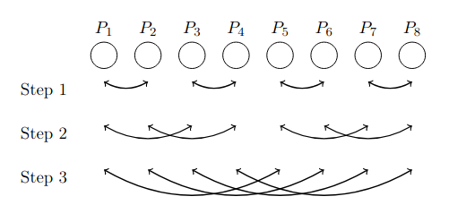

# Collective Operations

## Execution Model - Message Passing

 - $time = latency + message\_size / bandwidth$

 - $t = L + m/B$

 - Store-and-forwarrd model is assumed for intermediate nodes that transmit a message (A node receives the full message M before transmitting it).

 - Full-duplex communication channels.

 - We assume that a processor can send data, receive data, and perform computation on local data at the same time.

## Collective Operations

**Main collective operations:** Broadcast, Scatter, Gather, Reduce, All-gather, All-reduce, All-to-all


## Implementation of Collective Operations

Decide about underlying network topology. This topology defines the distance in number of hops between any 2 processors in the dist. system. 1-hop $\implies$ direct link between 2 processors; $n$-hop $\implies$ $n-1$ processors on the path from src. to dest. We will consider a  **fully connected network**.

Collective operations metrics:
 - $L$: Latency from when the operation is initiated until it is completed.
 - $B$: Bandwidth.

### Broadcast
Methods:
 - One sends to all: $t = (n-1) * (L + m/B)$
 - Binomial tree: $t = log(n) * (L + m/B)$


Second algorithm scales much better as its performance is proportional to the log of the number of nodes.

### All-gather
- recursive doubling: $t = ... log(n)$



## Collective Operations With Unidirectional Ring

**Note:** Although algorithms built based on a virtual ring topology suffer from a high latency, there are use-cases where they can be very efficient in practice. This is especially the case when the number of processors involved in the communication is not a power of two and when the message is large (but ring topology scales bad for large number of nodes). A domain where ring-based algorithms are used today is distributed deep learning. Distributed deep learning algorithms heavily rely on the all-reduce collective operation, and run this operation with large messages and few nodes.

```python
def bcast_ring(m,k):
    my_id = my_num()
    n = num_procs()

    if my_id != k:
        recv(m, (my_id-1)%n)

    if my_id != (k-1)%n:
        send(m, (my_id+1)%n)
```

$T_{bcast-ring}(m) = (n-1)*(L+m/B)$

Can be improved with pipelining (message split into $r$ packets):
- Time for first packet to reach the last node is $(n-1)*(L+m/r*1/B)$
- After first packet arrives, we are still waiting for $r-1$ packets.

$T_{bcast-ring}(m) = (n+r-2)*(L+m/r*1/B)$
