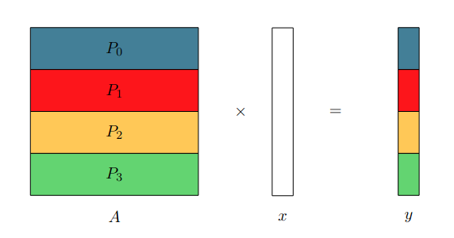

# Distributed Algorithms

## Performance

- Cost of running computaion
- Cost of moving data (Data transfer from local memory to CPU is ignored (consistance data access))

3 Terms:
- Compute: number of flops * time per flop
- Latency: number of messages * latency per message
- Bandwidth: Amount of data / bandwidth (machine, network)

Note: time per flop << 1/bandwidth << latency $\implies$ minimize num messages, then minimize ammount of data being transfered, then try to improve flops

$T = L + m/B$

## Stencil

Example: $C_{new} = update(C_{old}, W_{new}, N_{new})$

- Blocked strategy (square chunks): Very little parallelism
- Greedy strategy (assign a row to each processor): Good parallelism

```c++
def greedy():
    int A[N];
    int north;

    for(int j = 1; j < N; j++)
    {
        recv(&north, rank-1);
        A[j] = update(A[j], A[j-1], north);
        send(A[j], rank+1);
    }
```

Can be imporved using non-blocking communication

More rows thand processes $\implies$ round-robin assignment. Assigning blocks of rows for each process would reduce parallelism.

Assuming update(...) takes time $W$ and $b = sizeof(cell)/B$:

$T_{step} = W + L + b$

$T = ((p-1) + N^2/p)*T_{step}$

$T_p = N^2/p * (W + L + b)$

$speedup = T_{seq}/T_{par} = p * W/(W + L + b)$

Speedup proportional to $p$, The higher the latency and the lower the bandwidth the worse.

Possible optimization (reduce latency): Send vector of values to the south instead of just one value. Disadvantage: computation startup time increases.

Assuming a vector length of $k$:

$T_{step} = k * (W+b) + L$

$T = (p-1) + N^2/(p*k) * T_{step}$

Considering a very large $N$:

$T \approx N^2/p*(W + b + L/k)$

Latency reduced. Next step reduce bandwidth $\implies$ reduce amount of data being exchanged. Solution: each process is assigned $R$ rows instead of 1.

Each process processes a chunk of $k*R$ cells, and then sends results south.


$T_{step} = k*R*W + k*b + L$

$T = (p - 1 - N^2/(p*k*r)) * T_{step}$

$T \approx N^2/p*(W + b/r + L/(k*r))$

Performance proportional by $b/r$ (reduce bandwidth) and by $L/(k*r)$ (reduce latency)

Note: This strategy is called bulk communication

## Matrix-Vector Multiplication

$y = Ax$

```c
for(int i = 0; i < n; i++)
{
    y[i] = 0;
    for(int j = 0; j < n; j++)
        y[i] = y[i] + A[i][j] * x[j];
}
```

Each value of y is a scalar product. Each scalar product is independent. Simple parallel version of the algorithm is distributing the rows of A over p processors and assume each process has a copy of $x$. Each processor computes $r = n/p$ scalar products in parallel.



For better modularity it is preferable to have $x$ distributed across the $p$ processors (Since we might want to execute various multiplications in sequence).

Considering a virtual ring network topology, the steps of one iteration of the new matrix-vector multiplication algorithm:

 - Each processor computes a partial result using the elements of x it has in its local memory.
 - Each processor sends its block of x to its successor and receives from its predecessor in the
virtual ring.

Algorithm has to run over $p$ iterations.


**Computing the execution time:**

 - $p$ processors, $n*n$ matrix size, $r=n/p$
 - L latency, B bandwidth, w computatoin time for one basic unit of work
 - Time to recieve message == Time to send message == $L+r/B$
 - $p$ itertations and computation and communication happen in parallel

$T_{MV}(p) = p*max(r^2 * w, L 'r/B) = max(n^2/p * w, p*L + n/B)$

When $n$ is large: $T_{MV}(p) \approx n^2/p * w$

## Principles

Note: Sometimes contradictory

 - Sending data in bulk to limit the impact of network latency.
 - Sending data early to avoid having idle processors.
 - Overlapping communication and computation.
 - Assigning blocks of data to processors to limit the amount of communication and have regular access patterns for the computation.
 - Applying cyclic data distribution to increase load balancing between processors and reduce idle time.
