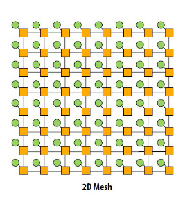
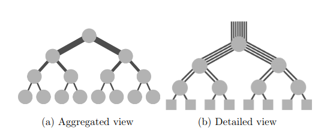
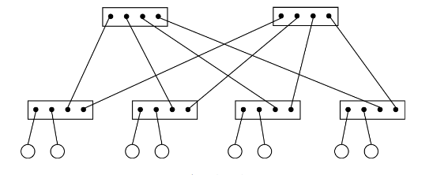

# Interconnection Networks

## Introduction

**Vocabulary:**
 - **Endpoints:** Sources and destinations of messages. Example processors.
 - **Switches:** Device connected to a fix set of links. It transmits a received pacakage to one or multiple links.
 - Links : Wire that is used to transfer data between endpoints and switches.

**Two kinds of networks:**
 - **Direct networks:** Nodes (endpoints) are directly connected (static). Node is both an endpoint and a switch.
 - **Indirect networks:** Nodes are connected inderctly through switches (dynamic since switches are reconfigurable)

**Network topology:** Describes the structure used to interconnect the processors, the switches and the links.

**Note:** Data movements are the most costly operations in parallel systems in terms of performance.

**Note:** In this lecture, we consider distributed memory systems. However interconnection networks also apply to shared-memory systems. In a multicore processor a Network-on-Chip (NoC) is used to move data bewteen the cores and the memory sub-systems (mem controllers and caches).

**Routing techniques:**
How a message goes from a source to a destination (Detail not covered). Three main aspects are taken into consideration:
 - **Routing algorithm:** Determines the path from the source to the destination.Algotithm can be deterministic or adaptive (take into acocount network contention).
 - **Switching strategy:** Determines how a message is transmitted along a selected path. It specifies the properties of the network regarding the following questions: 1) Is the message divided into packets? 2) Are the packets routed independetly? 3) What is the buffering strategy at the switch level?

## Static networks

### Network characteristics:

Static network can be represented as an unidrected (messages can be setn in both directions at the same time) graph where the vertices are the nodes and the edges are the network links. **Distance** between two nodes in the graph is the length of the shortest path between the two nodes. **Length** is the number of edges on the path from src to dest.

Some properties:
 - **Diameter:** Diameter $D$ of a graph is the maximal distance between any two nodes.
 - **Bisection bandwidth:** Bisection bandwidth $B$ is the minimum number of edges that must be removed to partition the network into two sub-netweorks of equal size.

The diameter gives information about the maximum possible latency. The bisection bandwidth tells us about the maximum throughput that can be achieved when $n/2$ communications are initiated simultaneously in a asystem included $n$ processoes. An aeeffiecient netweork is on for which the diameter is small and the nisectin bandwidth is large. In practice a balance must be found between optimization and cost of implementation.The degree of the graph is a good metric of the hardware cost for a given network.

### Static network examples

**Ring:**
- $Degree = 2$
- $Diamtere = \lfloor n/2 \rfloor$
- $Bisection Bandwidth = 2$

Cheap to implement but doesn't scale well since the diameter increases with the number of nodes.

**Fully-connected network:** Assuming $n$ nodes:
 - $Degree = n-1$
 - $Diameter = 1$
 - $Bisection Bandwidth = \lfloor n/2 \rfloor * \lceil n/2 \rceil$

The optimmal network from a performance point of view. Very costly to implement and not usable in practice for large scale systems.

**D-dimensinal mesh:** 

Note: Each node is simultaniously a endpoint (green) and switch (yellow).

 - $Degree = 4$
 - $Diameter = 2*(\sqrt{n} - 1)$
 - $Disection Bandwidth = \sqrt{n}$

Suitable to run computations that correspond to 2D space problems and where communication are mostly local, such as image processing. Can be difficult to deal with nodes at the edfes of the network that have a lower degree of connectivity.

**D-dimensional torus:**
Similar to a D-dimensional mesh except that additional links interconnect the first and the last nodes in each dimension.

 - $Degree = 4$
 - $Diameter = 2*\sqrt{n}$
 - $Disection Bandwidth = 2*\sqrt{n}$

 Compared to a mesh, a torus topology offers a smaller diameter (halved) and a larger bisection bandwidth (multiplied by two) for almost the same cost in terms of network links. D-dimensional Torus have good scalability properties.

## Dynamic networks

### Flat-Tree topology

Tree topology, where the processors are the leaves and the other nodes are switches. The main characteristic of a flat-tree is that each switch has the same number of links goind up and down. This can be understood as the links getting fatterm *i.e.* having a larger capacity towards the root of the tree.

Such a flat-tree can be costly to implement in practice because the switches towards the root become larger => more expensive. An alternative solution exists. It only relies on a set of switches having all the same capacity - *Folded Clos Topology*. 

Multiple paths exist from any source to any destination, which makes such a topology fault tolerant.

**2-level Flat-Tree:** Two levels of switches. Very popular in pratice because of its relatively low cost. The maximum size of such a network is limited by the number of ports of the individual switches in use.

Assuming a 2-Level Flat-Tree topology built out of switches with k ports:

- Number of switches at the upper level $= k/2$
- Total number of switches $=k + k/2 = 3*k/2$
- Max number of nodes $n = k*k/2 = k^2/2$
- $Diameter = 4$
- $BisectionBandwidth = \lfloor n/2 \rfloor$

Such a network has good properties: a low diameter and a high bisection bandwidth.